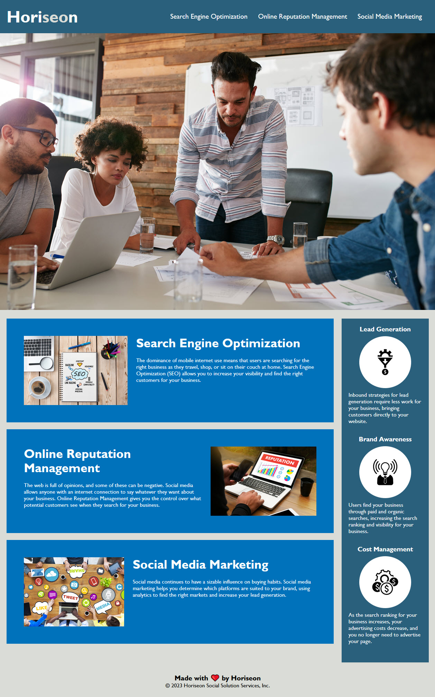

# Challenge 01 - Accessibility Refactor
## Description
This is the first of several weekly challenges provided by the University of Sydney Coding Bootcamp. This week's challenge was to refactor the HTML and CSS of a pre-prepared webpage to use more accessible conventions and Semantic HTML markup.

The challenge required the following skills to complete:
- Identifying elements that required refactoring through the use of tools such as Accessibility Checkers in browser DevTools
- An understanding of accessibility standards, such as the [Web Content Accessibility Guidelines (WCAG)](https://www.w3.org/WAI/standards-guidelines/wcag/)
- HTML knowledge to update the tags where appropriate to more semantic equivalents
- CSS knowledge to update selectors in line with changes, and consolidate identical properties where possible

The challenge outlined was addressed in the following manners:
- All images and graphics (excluding the hero graphic, which is decorative in nature), were captioned with `alt` text descriptions.
- The `div` elements throughout the document were replaced with semantic equivalents, such as:
    - Replaced the `div` elements used for the header, footer, and main content areas.
    - Replaced the `div` elements in the `main` element with `section` elements.
    - Replaced the `div` container for the sidebar with `aside`.
    - Replaced the `div` containers for each element of the `aside` as `articles` (standalone content that can be consumed independently of others).
- Converted the class-based CSS selectors that were updated to semantic HTML elements instead.
- Consolidated the class/id-based selectors that were identical to each other to better adhere to the readability and maintainability convention of "Don't repeat yourself" (DRY).
    - The selectors for the `sections`.
    - The selectors for `articles`.
    - Additionally, there were restructurings of where fonts were declared to minimise their repetition.
        - The majority font set used by body text was placed in the universal selector.
        - Headers retained their properties since these were changes from the universal selection.
- The title was updated to more meaningfully convey the page contents ("Horiseon | Our Services"), which is a breakdown of services the company offers.
- Lastly, to address contrast issues in the `aside` the following changes were made.
    - The background of the `aside` was changed to the same as the header, raising minimum contrast ratio to over 4.
    - The graphics were given a rounded background of `#FFF`, since the graphics were black and created a poor contrast with the updated colour.

## Usage
You can view the page under https://natpoulson.github.io/challenge-01-accessibility-refactor

You can verify that there are no major accessibility issues by opening the browser DevTools (F12), and checking the "Accessibility" or "Issues" tab (the verbiage depends on the browser).

## Preview

## Credits
- Thanks to edX for supplying the base project files.
- Thanks to Mozilla, for their excellent Accessibility checking tools in Firefox.

## License
This project is licensed under the [MIT License](./LICENSE).